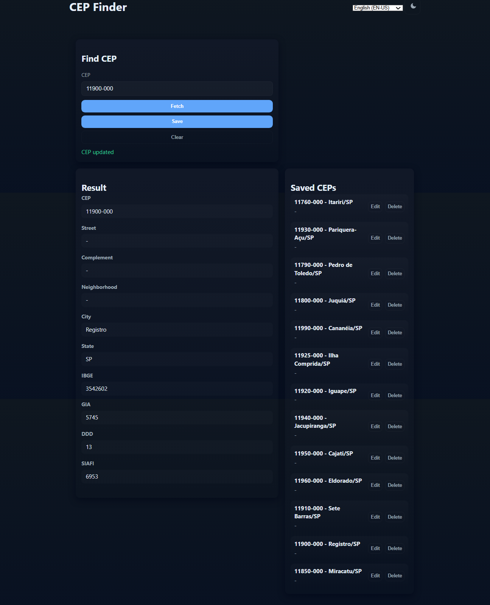

# Creating a Flutter App from Scratch to Consume the ViaCEP API

Project developed at Santander Bootcamp 2023 - Mobile with Flutter, under the guidance of specialist [Danilo Perez](https://github.com/perez-danilo "Danilo Perez").

In this challenge, you will have to build a Flutter application from scratch, putting into practice the concepts of asynchrony and API consumption.

**Challenge Checklist**:

- Create a Flutter application.
- Create a CEP class in Back4App.
- Query a CEP via the ViaCep API; if the result does not exist in Back4App, register it.
- Display the registered CEPs in a list, allowing for editing and deletion.

## Features

- Fetch CEP data from ViaCEP.
- Store CEP records in Back4App.
- List saved CEPs with refresh support.
- Edit and delete CEP records.
- Unit tests for model and fake Parse service.

## Requirements

- Flutter SDK (stable)
- Dart SDK compatible with Flutter
- Back4App account and application
- Internet connection for ViaCEP and Back4App

## Back4App Setup

1. Create a Back4App application.
2. Create a class named `Cep` with the following fields:
   - `cep` String
   - `logradouro` String
   - `complemento` String
   - `bairro` String
   - `localidade` String
   - `uf` String
   - `ibge` String
   - `gia` String
   - `ddd` String
   - `siafi` String
3. Obtain your **Application ID** and **Client Key** from Back4App.
4. Optionally configure class-level permissions for read/write during development.

## Installation

1. Clone the repository.
2. Open the project folder.
3. Update `lib/main.dart` with your Back4App credentials:

   ```dart
   const String appId = 'YOUR_BACK4APP_APP_ID';
   const String clientKey = 'YOUR_BACK4APP_CLIENT_KEY';
   const String parseServerUrl = 'https://parseapi.back4app.com';
   ```

4. Install dependencies:

    ```bash
    flutter pub get
    ```

## Run the App

```bash
flutter run
```



## Tests

Unit tests are included for the ``Cep`` model and a fake Parse service.
Run tests:

```bash
flutter test
```

If tests require ``uuid``, add it to ``dev_dependencies`` in ``pubspec.yaml``:

```yaml
dev_dependencies:
  uuid: ^3.0.6
  flutter_test:
    sdk: flutter
```

## Tecnologies Used

- **Dart (Flutter)**: developing the mobile application, implementing asynchronous API calls, state management, and the user interface.
- **AI (Assistive)**: providing contextual suggestions and accessibility improvements during development and testing.

## Notes

- Keep Back4App keys secure for production.
- The app uses Portuguese keys when interacting with ViaCEP and Back4App but exposes English property names in the Dart model.
- For network testing, consider injecting an ``http.Client`` and using ``MockClient`` in tests.

[LICENSE](/LICENSE)
